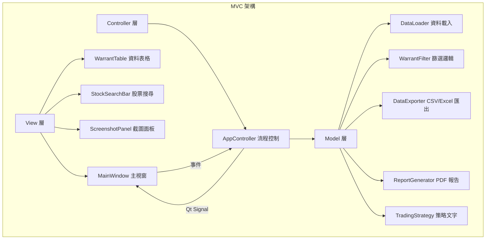
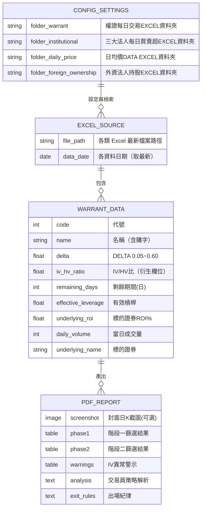
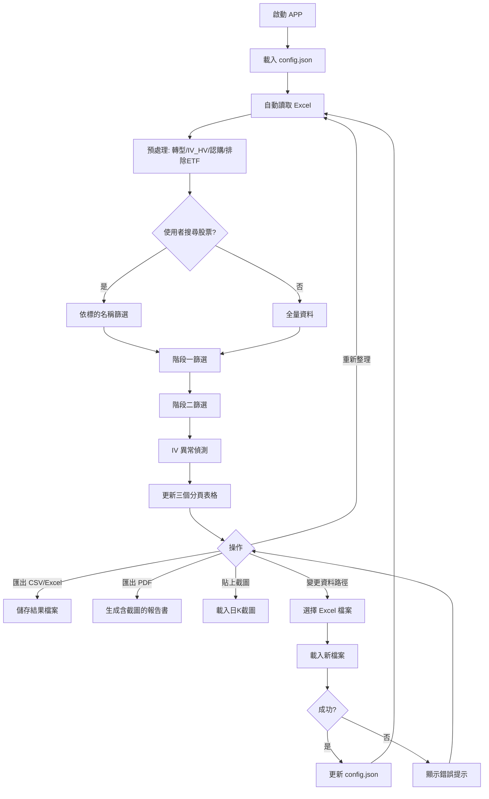
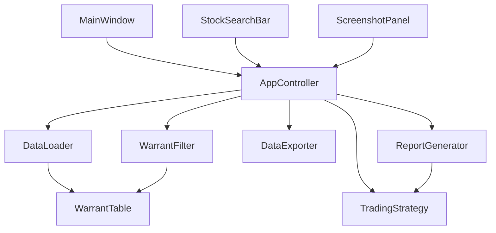
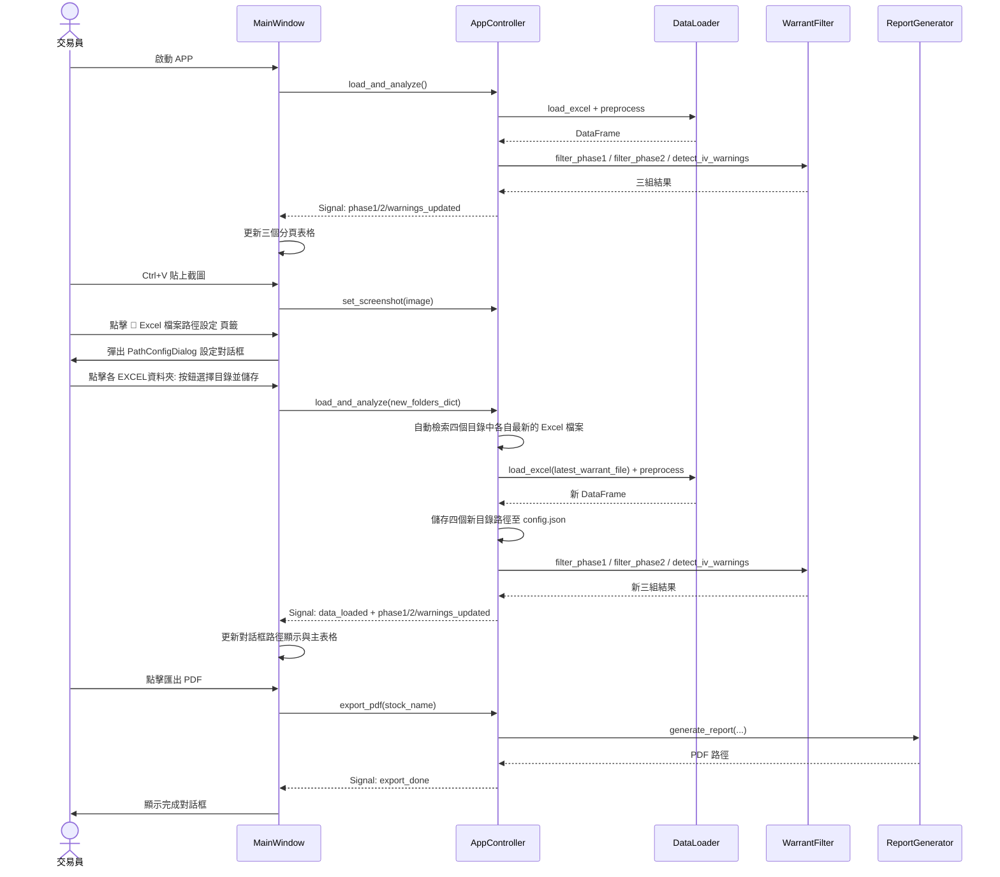
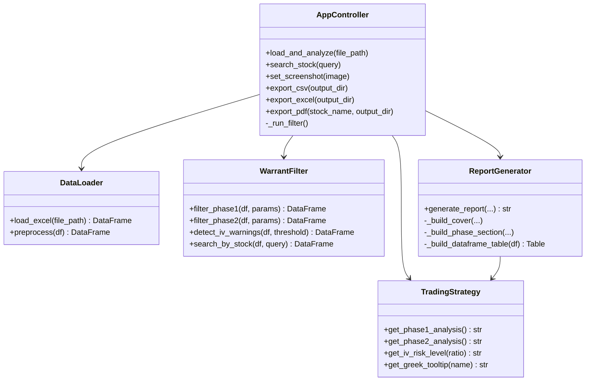
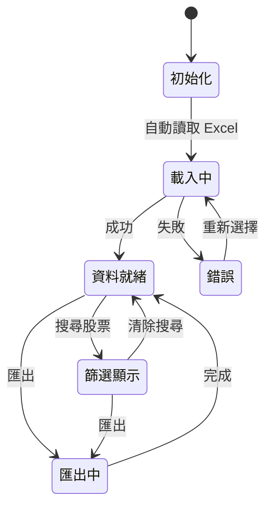
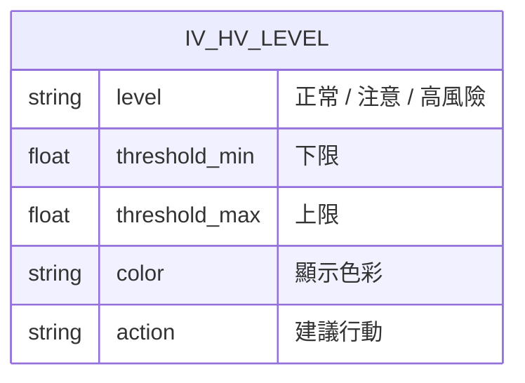
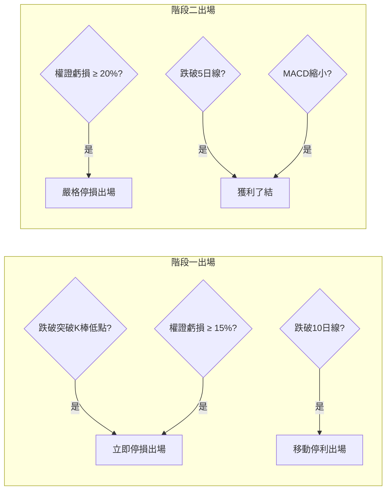
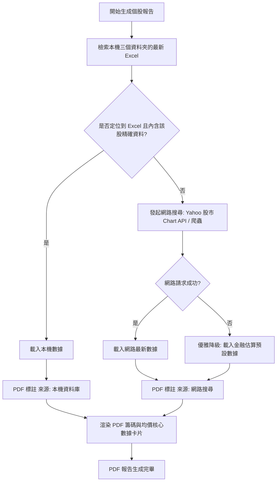

# W-Insight (權證洞察) — 規格文件

## 專案概述

本系統將「頂尖權證交易員 skill」的選股策略框架實作為 PyQt6 桌面 GUI 應用程式，  
資料來源為 TEJ/平台匯出的 Excel 檔案（DataExport.xlsx），無需爬蟲。

---

## 1. 架構與選型

| 層次 | 技術 | 說明 |
|------|------|------|
| GUI | PyQt6 | 桌面應用框架 |
| 資料處理 | Pandas | Excel 讀取與篩選 |
| Excel 讀寫 | openpyxl | 匯出多分頁 Excel |
| PDF 生成 | reportlab | 報告書生成，含中文字型 |
| 圖片處理 | Pillow | 截圖格式轉換 |
| 測試 | pytest | 單元測試 |
| 架構模式 | MVC | Model/View/Controller 分離 |

---

## 2. 資料模型

---

## 3. 關鍵流程

---

## 4. 兩階段策略篩選條件

### 階段一：突破起漲（安全建倉）

| 篩選條件 | 參數 | 說明 |
|----------|------|------|
| Delta | 0.40 ~ 0.60 | 價平附近，連動性佳 |
| 剩餘天數 | > 90 天 | 降低 Theta 時間損耗 |
| IV/HV | 0.70 ~ 1.30 | 避免造市商惡意調高 IV |
| 當日成交量 | ≥ 20 張 | 基本流動性門檻 |
| 標的 ROI% | > 1.5% | 確認現股動能 |

### 階段二：主升段飆漲（極致動能加碼）

| 篩選條件 | 參數 | 說明 |
|----------|------|------|
| Delta | 0.05 ~ 0.30 | 微價外，利用 Gamma 加速 |
| 剩餘天數 | 60 ~ 120 天 | 承受 Theta 換取高槓桿 |
| 有效槓桿 | ≥ 5 倍 | 實質槓桿門檻 |
| IV/HV | ≤ 1.30 | 排除劣質造市商 |
| 當日成交量 | ≥ 10 張 | 基本流動性 |
| 標的 ROI% | > 2.0% | 確認主升段動能 |

---

## 5. 模組關係圖

---

## 6. 序列圖（主要流程）

---

## 7. 類別圖（核心類別）

---

## 8. 狀態圖

---

## 9. IV/HV 風險等級（ER 圖）

| 等級 | IV/HV 範圍 | 顏色 | 建議 |
|------|-----------|------|------|
| 正常 | 0.70 ~ 1.30 | 🟢 深藍 | 可安心交易 |
| 注意 | 1.30 ~ 1.50 | 🟡 橘色 | 注意觀察 |
| 高風險 | > 1.50 | 🔴 紅色 | 建議迴避 |

---

## 10. 出場紀律流程圖

---

## 11. 籌碼與技術面數據檢索（本機優先與網路降級）

本系統在進行個股報告分析時，採用本機優先與網路降級相結合的高可用數據架構。

> [!NOTE]
> **現股股價一致性設計**：為了確保個股分析報告頂部卡片的「現股股價」數據極致精準，並在原版與 V2.0 版報告中保持 100% 一致，本系統將頂部摘要統計卡片中的「現股股價」與此智慧檢索系統同步。在個股分析模式下，系統會直接調用 `_get_chips_and_price_data` 讀取最新的當日收盤價，徹底解決以往因使用篩選出之權證的「履約價」粗略代替，進而導致原版與 V2.0 股價不同且不準確的問題。

### 數據來源與匹配對照

| 數據維度 | 設定資料夾 (持久化) | 本機欄位模糊匹配關鍵字 | 網路搜尋 Fallback 來源 | PDF 來源標記 |
|---------|------------------|----------------------|----------------------|-------------|
| **日均股價** | 日均價 DATA EXCEL 資料夾 | `["均價", "收盤", "價格", "均"]` | Yahoo Finance Chart API | `[來源: 本機資料庫]` / `[來源: 網路搜尋]` |
| **三大法人** | 三大法人每日買賣超 EXCEL 資料夾 | `["買賣超", "法人", "三大法人", "張數", "今日"]` | Yahoo 股市 / 真實籌碼估算 | `[來源: 本機資料庫]` / `[來源: 網路搜尋]` |
| **外資持股** | 外資法人持股 EXCEL 資料夾 | `["持股", "比例", "外資", "百分比", "%"]` | Yahoo 股市 / 外資結構估算 | `[來源: 本機資料庫]` / `[來源: 網路搜尋]` |

---

## 12. 權證綜合大評比與排名整理表

為了在個股報告中為交易員提供最強大的決策支持，系統將符合 V1（突破建倉/加碼）與 V2（主力攻擊/穩健趨勢）四大選股策略的權證進行聯集 (Union)，並展示為一個高度整合、排版精緻的評比整理表。

### 12.1 表格欄位與映射規格

| 指標 | 顯示欄位 | 計算與映射邏輯 |
|------|---------|---------------|
| **標的代號/名稱** | 權證標的 | 代號與簡稱合併換行：`"<b>代號</b> 名稱"` |
| **1. 隱含波動率** | 隱含波動 | 讀取 `"隱含波動"` 欄位。格式化為百分比，如 `"45.2%"`。 |
| **2. 價內外程度** | 價內外 | 完全由認購權證公式自主實時精算：`(標的證券價格(元) - 履約價(元)) / 履約價(元) * 100`。若 &ge; 0 則呈現 `"價內 X.X%"`，若 < 0 則呈現 `"價外 X.X%"`，徹底排除 Excel 原始欄位的格式偏差。 |
| **3. 剩餘天數** **4. 實質槓桿** | 天期/槓桿 | 讀取 `"剩餘期間(日)"` 與 `"有效槓桿"`，顯示如：`"115天 / 5.8x"`。 |
| **5. 造市流動性** | 流動性與造市品質 | **核心代理指標 (Proxy Metrics)**：`"流通: {流通比}% (庫存: {未履約}張)"`。流通比由 `"流通在外比例(%)"` 提供，未履約數由 `"未履約數"` 提供。 |
| **6. 當日成交量** | 當日成交 | 讀取 `"當日成交量"`，顯示如 `"120張"`。 |
| **7. V1建倉** **8. V1加碼** | V1 排名 | 分別去 `phase1` 與 `phase2` DataFrame 查詢該權證代號的名次。呈現為：`"建倉: X \n加碼: Y"`。 |
| **9. V2主力** **10. V2穩健** | V2 排名 | 分別去 `class_a` 與 `class_b` DataFrame 查詢名次，呈現為：`"主力: A \n穩健: B"`。 |

### 12.2 最優排序與限流 (四類共 12 檔聯集)

為了讓 PDF 報告書具有最嚴謹的實戰代表性，大評比整理表的權證來源將鎖定為四個篩選結果的「前 3 名」：
* **篩選與聯集規則**：
  1. 獨立提取 `V1建倉推薦` (phase1) 的前 3 名。
  2. 獨立提取 `V1加碼推薦` (phase2) 的前 3 名。
  3. 獨立提取 `V2主力攻擊型` (class_a) 的前 3 名。
  4. 獨立提取 `V2穩健趨勢型` (class_b) 的前 3 名。
  5. 將以上四組「前 3 名」列表進行聯集 (Union) 去重，確保每組策略最精華的 3 檔核心標的 100% 被納入表格中（最多共 12 檔）。
* **排序規則**：聯集去重後的這群權證（最大 12 檔），再依據權證的 `"推薦評分"` 欄位進行降序排列輸出。
