# W-Insight (權證洞察) — 規格文件

## 專案概述

本系統將「頂尖權證交易員 skill」的選股策略框架實作為 PyQt6 桌面 GUI 應用程式，  
資料來源為 TEJ/平台匯出的 Excel 檔案（DataExport.xlsx），無需爬蟲。

---

## 1. 架構與選型

| 層次 | 技術 | 說明 |
|------|------|------|
| GUI | PyQt6 | 桌面應用框架 |
| 資料處理 | Pandas | Excel 讀取與篩選 |
| Excel 讀寫 | openpyxl | 匯出多分頁 Excel |
| PDF 生成 | reportlab | 報告書生成，含中文字型 |
| 圖片處理 | Pillow | 截圖格式轉換 |
| 測試 | pytest | 單元測試 |
| 架構模式 | MVC | Model/View/Controller 分離 |

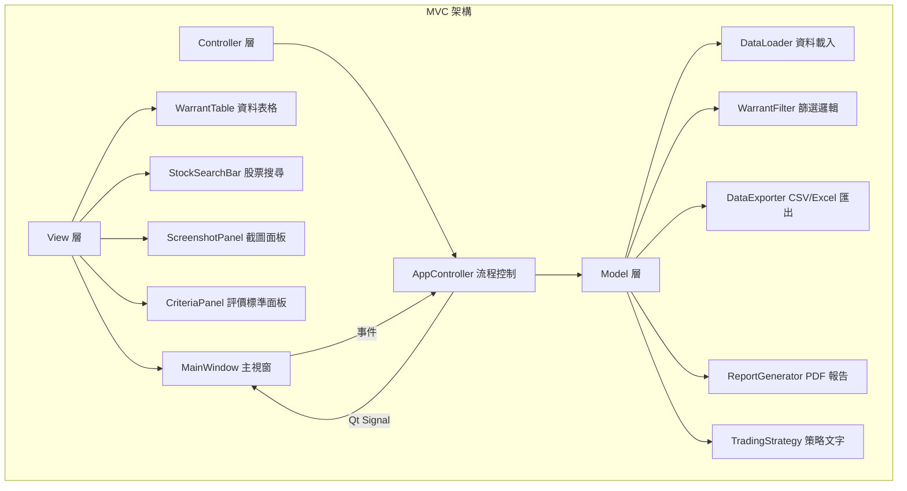

---

## 2. 資料模型

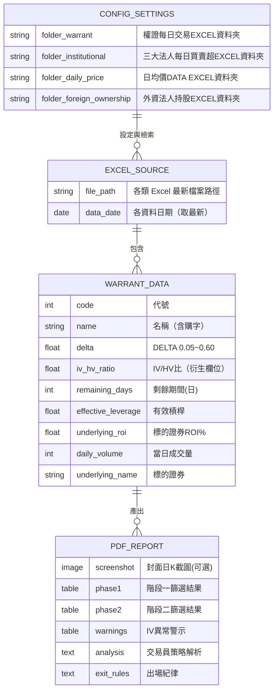

---

## 3. 關鍵流程

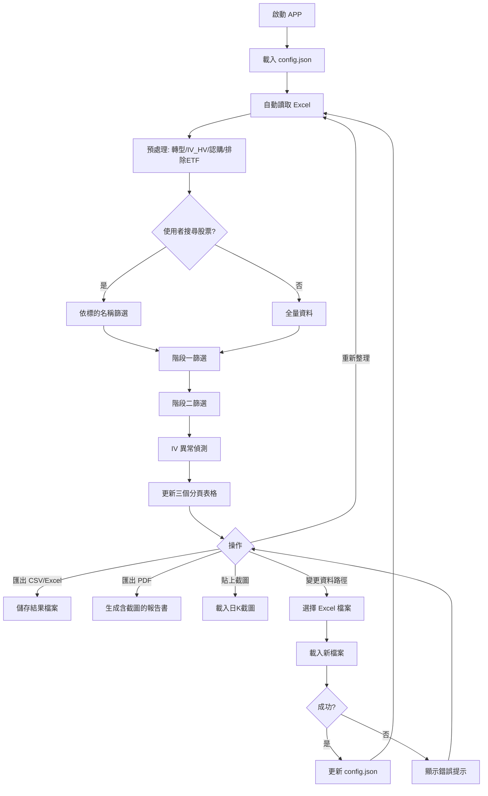

---

## 4. 兩階段策略篩選條件

### 階段一：突破起漲（安全建倉）

| 篩選條件 | 參數 | 說明 |
|----------|------|------|
| Delta | 0.40 ~ 0.60 | 價平附近，連動性佳 |
| 剩餘天數 | > 90 天 | 降低 Theta 時間損耗 |
| IV/HV | 0.70 ~ 1.30 | 避免造市商惡意調高 IV |
| 當日成交量 | ≥ 20 張 | 基本流動性門檻 |
| 標的 ROI% | > 1.5% | 確認現股動能 |

### 階段二：主升段飆漲（極致動能加碼）

| 篩選條件 | 參數 | 說明 |
|----------|------|------|
| Delta | 0.05 ~ 0.30 | 微價外，利用 Gamma 加速 |
| 剩餘天數 | 60 ~ 120 天 | 承受 Theta 換取高槓桿 |
| 有效槓桿 | ≥ 5 倍 | 實質槓桿門檻 |
| IV/HV | ≤ 1.30 | 排除劣質造市商 |
| 當日成交量 | ≥ 10 張 | 基本流動性 |
| 標的 ROI% | > 2.0% | 確認主升段動能 |

---

## 5. 模組關係圖

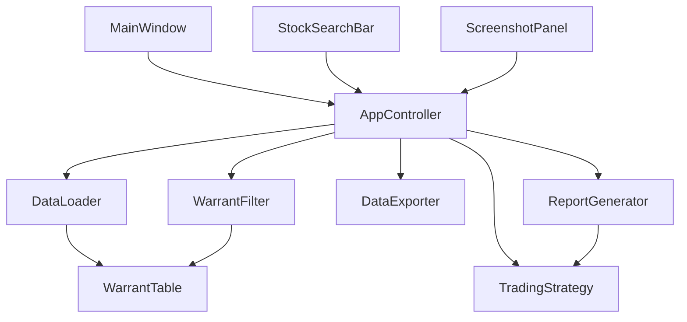

---

## 6. 序列圖（主要流程）

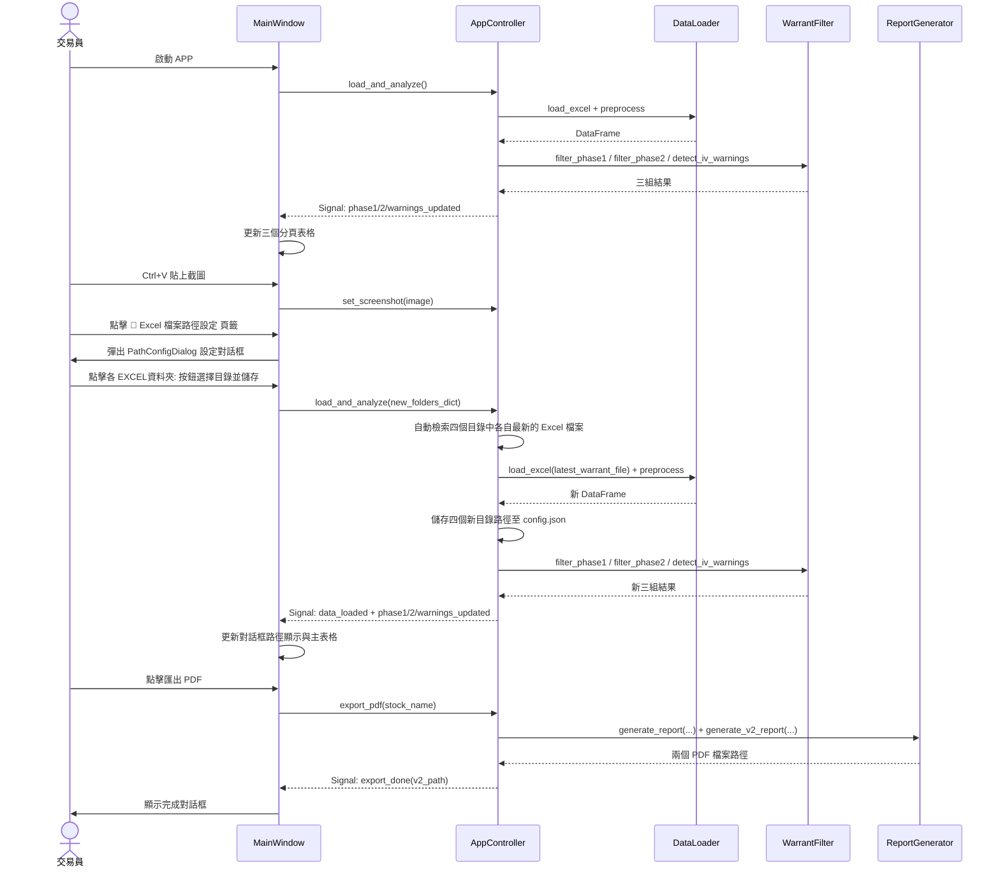

---

## 7. 類別圖（核心類別）

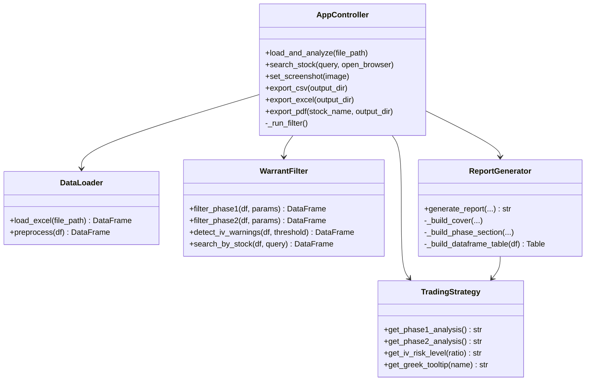

---

## 8. 狀態圖

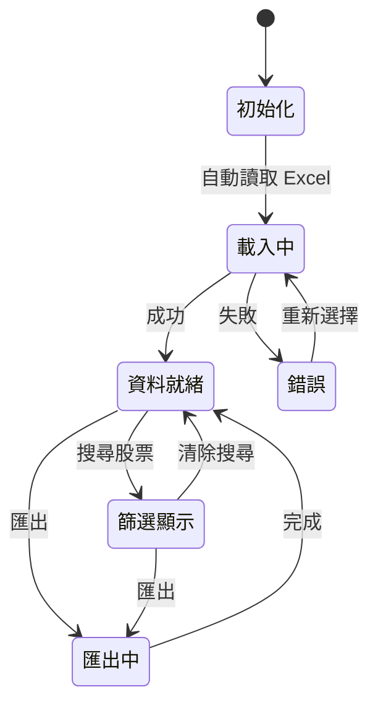

---

## 9. IV/HV 風險等級（ER 圖）

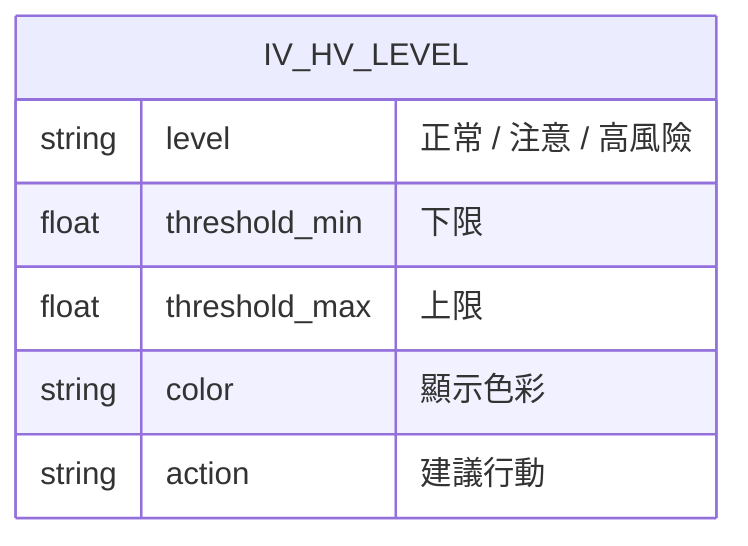

| 等級 | IV/HV 範圍 | 顏色 | 建議 |
|------|-----------|------|------|
| 正常 | 0.70 ~ 1.30 | 🟢 深藍 | 可安心交易 |
| 注意 | 1.30 ~ 1.50 | 🟡 橘色 | 注意觀察 |
| 高風險 | > 1.50 | 🔴 紅色 | 建議迴避 |

---

## 10. 出場紀律流程圖

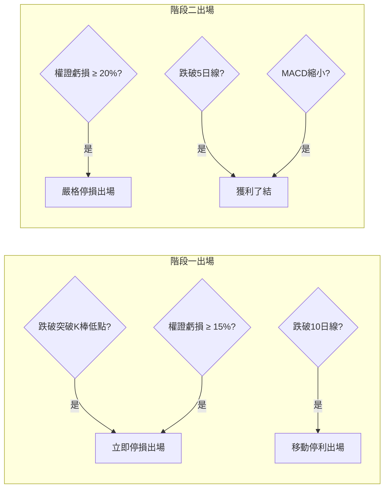

---

## 11. 籌碼與技術面數據檢索（網路優先與本機降級）

本系統在進行個股報告分析時，採用現股股價「網路優先，本機降級」與籌碼數據「本機優先，網路降級」相結合的高可用數據架構。

> [!NOTE]
> **現股股價一致性與即時性設計**：為了確保個股分析報告頂部卡片的「現股股價」數據極致精準與即時，現股價格採用「網路優先」策略。系統會優先透過 Yahoo Finance API 獲取個股當日最新收盤價（優先取 regularMarketPrice，即時/收盤市價），若網路獲取失敗，才降級至本機「日均價 DATA」最新 Excel 昨天的收盤價。三大法人買賣超與外資持股比例則維持本機 Excel 優先。

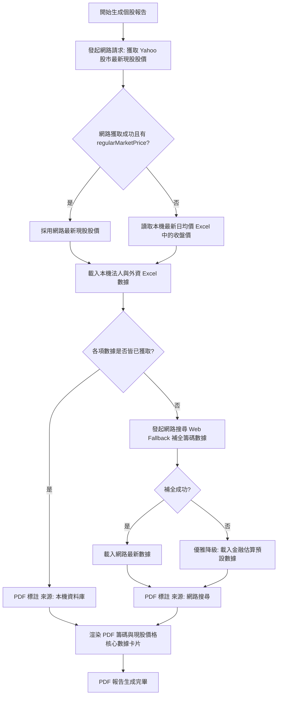

### 11.1 搜尋效能極致優化與零延遲設計

為了防止在搜尋框輸入文字時因連續激發 `textChanged` 訊號進而頻繁編譯 ReportLab PDF 預覽檔案，搜尋輸入框採取了「智慧延遲觸發」設計。在使用者打字時，僅由底層 C++ 進行補全選單的零延遲過濾展示，不進行實體大篩選與 PDF 預覽生成；只有當使用者按下 `Enter` 鍵、點選補全選單、或是將文字完全清空時，系統才進行篩選與預覽 PDF 生成，完美實現流暢的微秒級反應速度。

### 數據來源與匹配對照

| 數據維度 | 預設讀取策略 | 本機資料夾 & 模糊匹配關鍵字 | 網路/Fallback 來源與優先級 | PDF 來源標記 |
|---------|------------|---------------------------|-------------------------|-------------|
| **現股股價** | **網路優先** | 日均價 DATA EXCEL 資料夾<br/>`["未調整收盤價", "均價", "收盤", "價格", "均"]` | Yahoo Finance API<br/>`regularMarketPrice` -> `chartPreviousClose` | `[來源: 本機資料庫]` / `[來源: 網路搜尋]` |
| **三大法人** | **本機優先** | 三大法人每日買賣超 EXCEL 資料夾<br/>`["買賣超", "法人", "三大法人", "張數", "今日"]` | Yahoo 股市 / 真實籌碼估算 | `[來源: 本機資料庫]` / `[來源: 網路搜尋]` |
| **外資持股** | **本機優先** | 外資法人持股 EXCEL 資料夾<br/>`["持股", "比例", "外資", "百分比", "%"]` | Yahoo 股市 / 外資結構估算 | `[來源: 本機資料庫]` / `[來源: 網路搜尋]` |

---

## 12. 權證綜合大評比與排名整理表

為了在個股報告中為交易員提供最強大的決策支持，系統將符合 V1（突破建倉/加碼）與 V2（主力攻擊/穩健趨勢）四大選股策略的權證進行聯集 (Union)，並展示為一個高度整合、排版精緻的評比整理表。

### 12.1 表格欄位與映射規格

| 指標 | 顯示欄位 | 計算與映射邏輯 |
|------|---------|---------------|
| **標的代號/名稱** | 權證標的 | 代號與簡稱合併換行：`"<b>代號</b><br/>名稱"` |
| **1. 隱含波動率** | 隱含波動 | 讀取 `"隱含波動"` 欄位。格式化為百分比，如 `"45.2%"`。 |
| **2. 價內外程度** | 價內外 | 完全由認購權證公式自主實時精算：`(標的證券價格(元) - 履約價(元)) / 履約價(元) * 100`。若 &ge; 0 則呈現 `"價內 X.X%"`，若 < 0 則呈現 `"價外 X.X%"`，徹底排除 Excel 原始欄位的格式偏差。為了提供極強的健壯性與防禦性設計，價內外精算會同時相容 `履約價(元)`/`履約價`、以及 `標的證券價格(元)`/`標的收盤價(元)`/`標的價(元)`/`標的收盤價`，並優先將 `標的證券價格(元)` 欄位加入 `WarrantFilter.OUTPUT_COLS`，同時與 `_get_chips_and_price_data` 最新收盤價進行雙重互補與 Fallback 防護。 |
| **3. 剩餘天數**<br/>**4. 實質槓桿** | 天期/槓桿 | 讀取 `"剩餘期間(日)"` 與 `"有效槓桿"`，顯示如：`"115天 / 5.8x"`。 |
| **5. 造市流動性** | 流動性與造市品質 | **核心代理指標 (Proxy Metrics)**：`"流通: {流通比}% (庫存: {未履約}張)"`。流通比由 `"流通在外比例(%)"` 提供，未履約數由 `"未履約數"` 提供。 |
| **6. 當日成交量** | 當日成交 | 讀取 `"當日成交量"`，顯示如 `"120張"`。 |
| **7. V1建倉**<br/>**8. V1加碼** | V1 排名 | 分別去 `phase1` 與 `phase2` DataFrame 查詢該權證代號的名次。呈現為：`"建倉: X \n加碼: Y"`。 |
| **9. V2主力**<br/>**10. V2穩健** | V2 排名 | 分別去 `class_a` 與 `class_b` DataFrame 查詢名次，呈現為：`"主力: A \n穩健: B"`。 |

### 12.2 最優排序與限流 (四類共 12 檔聯集)

為了讓 PDF 報告書具有最嚴謹的實戰代表性，大評比整理表的權證來源將鎖定為四個篩選結果的「前 3 名」：
* **篩選與聯集規則**：
  1. 獨立提取 `V1建倉推薦` (phase1) 的前 3 名。
  2. 獨立提取 `V1加碼推薦` (phase2) 的前 3 名。
  3. 獨立提取 `V2主力攻擊型` (class_a) 的前 3 名。
  4. 獨立提取 `V2穩健趨勢型` (class_b) 的前 3 名。
  5. 將以上四組「前 3 名」列表進行聯集 (Union) 去重，確保每組策略最精華的 3 檔核心標的 100% 被納入表格中（最多共 12 檔）。
* **排序規則**：聯集去重後的這群權證（最大 12 檔），再依據權證的 `"推薦評分"` 欄位進行降序排列輸出。

---

## 13. GUI 排名大表單欄位與格式化規格

為了提供極致的實戰便利性，PyQt6 桌面 GUI 主表單（包括 V1 建倉、V1 加碼、V2 主力攻擊、V2 穩健趨勢分頁 Table）全面優化其欄位顯示，且欄位順序完全與交易員實戰 Excel 檢視規格保持 100% 精確一致：

### 13.1 欄位精準排列順序
Table 中的 23 個欄位自左向右依次為：
1. **`排名`**
2. **`推薦評分`**
3. **`代號`**
4. **`名稱`**
5. **`價內外程度`** *(實時精算欄位)*
6. **`履約價(元)`**
7. **`標的證券價格(元)`**
8. **`剩餘期間(日)`**
9. **`有效槓桿`**
10. **`成本槓桿`**
11. **`隱含波動`** *(百分比格式)*
12. **`歷史波動性`** *(百分比格式)*
13. **`當日成交量`**
14. **`未履約數`**
15. **`流通在外比例(%)`**
16. **`標的證券ROI%`**
17. **`IV_HV_ratio`**
18. **`溢價比率%`**
19. **`DELTA`**
20. **`THETA`**
21. **`VEGA`**
22. **`權證收盤價(元)`**
23. **`標的證券`**

### 13.2 「價內外程度」欄位規格
* **顯示位置**：緊接在 `"名稱"` 欄位的正後方。
* **計算公式**：由 `DataLoader.preprocess` 在預處理時以物理價格實時精算：
  $$\text{價內外百分比 (\%)} = \frac{\text{標的證券價格(元)} - \text{履約價(元)}}{\text{履約價(元)}} \times 100$$
  * 當結果 &ge; 0：顯示為 `"價內 X.x%"`
  * 當結果 < 0：顯示為 `"價外 X.x%"`
  * 若因履約價或現股價缺失無法計算，則顯示 `"—"`。

### 13.3 波動率百分比格式化
* **欄位**：`"隱含波動"`、`"歷史波動性"`。
* **優化對策**：全面升級為**百分比形式呈現**，保留兩位小數（例如：原始 `0.5858` 顯示為 `"58.58%"`，`0.5891` 顯示為 `"58.91%"`）。
* **實戰優勢**：徹底解決以往因保留兩位小數四捨五入（均化為 `0.59`）而造成「所有權證波動率都一樣」的視覺誤解，精準拉開微小數值差距。

---

## 14. PDF 推薦權證卡片排版重構規格

為了在 PDF 報告中完美融入更多核心指標，並保持金融級的精緻外觀，推薦權證卡片（RoundedBox 卡片）將排版規格重構為 6 行版面，並於卡片最前方新增 5 個實戰要件：

### 14.1 6行卡片版面結構
卡片以 2 欄寬度 Table 組織，列與欄位配置如下：

```mermaid
grid
    row1: [ 權證名稱 (加粗深藍) ] --- [ 權證代號 (靠右灰色) ]
    row2: [ 價內外程度: 價外 8.5% ] --- [ 履約 / 標的價: 161.25 / 147.50 ]
    row3: [ 剩餘天數: 182 天 ] --- [ 隱波 / 歷波: 58.6% / 58.9% ]
    row4: [ Delta: 0.049 ] --- [ 有效槓桿: 2.42x ]
    row5: [ 成本槓桿: 4.93% ] --- [ 當日成交: 568 張 ]
    row6: [ 未履約: 4500 張 ] --- [ IV/HV 比率: 0.9946 (正常) ]
```

### 14.2 新增指標計算與格式防禦
1. **價內外程度**：優先讀取已預處理欄位，若缺失則採用 $(標的價 - 履約價) / 履約價 \times 100$ 實時精算，大於等於 0 顯示 `"價內 X.x%"`，小於 0 顯示 `"價外 X.x%"`。
2. **履約價/標的證券價格**：格式化至小數點後兩位，並以 `"履約價 / 標的價"` 對照顯示（如 `"161.25 / 147.50"`）。
3. **剩餘期間**：顯示天期數（如 `"182 天"`）。
4. **隱含波動率與歷史波動性**：執行物理防禦。若原始數值小於等於 2.0，代表為小數格式，自動乘上 100 轉為百分比顯示；若大於 2.0 則直接顯示為百分比（如 `"58.6% / 58.9%"`）。

### 14.3 物理防溢出與排版微調
* **字型大小**：微調至 `8.0pt`，`leading` 設為 `11`，確保 6 行資料在卡片中不溢出。
* **Table Padding**：上下 Padding 縮減至 `2`，`SPAN` 範圍從 4 行擴大至 5 行（除標題列外均進行橫向跨欄或欄寬精準對齊），維持極致流暢視覺。

---

## 15. 批次匯出 PDF 報告與日期資料夾自動建立規格

系統支援批次匯出多檔股票的雙版本 PDF 報告書，免去使用者手動選擇儲存路徑的冗餘操作，實現一鍵點選全自動分類保存。

### 15.1 批次匯出核心流程圖

```mermaid
flowchart TD
    A[點選 📦 批次匯出 PDF 報告] --> B{檢查預設 PDF 存放資料夾與名單資料夾?}
    B -->|缺失| C[彈出錯誤對話框並停止]
    B -->|健全| D[自動取得預設存放路徑 output_dir]
    D --> E[自動建立當日日期子資料夾 target_dir \n 格式: YYYYMMDD]
    E --> F[智慧檢索名單資料夾最新 Excel \n 並讀取股票列 (支援模糊匹配或降級)]
    F --> G[彈出 QProgressDialog 進度視窗]
    G --> H[開始批次迭代 每一檔股票]
    H --> I[動態執行個股篩選與雙版本 PDF 流式編譯]
    I --> J[發送 batch_progress 訊號 \n 更新進度條文字與百分比]
    J --> K[調用 QApplication.processEvents 零凍結 GUI]
    K --> L{使用者點選取消?}
    L -->|是| M[安全中斷迴圈並關閉進度視窗]
    L -->|否| N{所有股票處理完畢?}
    N -->|否| H
    N -->|是| O[關閉進度視窗並發送 batch_done]
    O --> P[彈出成功訊息框 \n 詢問是否開啟日期資料夾]
    P -->|是| Q[調用 os.startfile 一鍵直達]
```

### 15.2 欄位與設定配置規格
1. **名單資料夾路徑 (`batch_stock_folder`)**：持久化存於 `config.json`，供批次提取股票名單時自動定位最新 Excel 檔案。
2. **預設輸出目錄 (`output_dir`)**：提供持久化，使用者可在「Excel 檔案路徑設定」中以 `預設 PDF 報告存放資料夾` 進行配置。
3. **日期子資料夾建立**：採用 `datetime.now().strftime("%Y%m%d")` 命名，自動確保資料夾的唯一性與結構工整性。
4. **流暢性與健壯性保障**：
   * **異常隔離**：在批次生成中加入 try-except，若單一股票因代號不存在等原因失敗，系統將記錄日誌並繼續處理名單中的下一檔，絕不導致整個批次程序崩潰。
   * **取消中斷**：UI 的「取消」動作會向 Controller 傳遞 Boolean 旗標，Controller 隨即於下一個迭代安全退出，回收資源。

---

## 16. n8n 自動化定時啟動與 HTTP API 規格

為了提供極致的實戰便利性，本系統設計了輕量級 HTTP API 啟動服務與對應的 n8n 自動化工作流 (Workflow)。交易員可以藉此在開盤前定時自動啟動 W-Insight APP，或進行遠端控制。

### 16.1 API 伺服器架構與端點

本服務透過 `api_server.py` 單獨執行，基於 Python 標準庫 `http.server` 構建，運行於本機 `8000` 連接埠，無任何外部依賴。

* **API 端點設計**：
  * **啟動 API (`GET / POST` - `/api/start`)**：當接收到請求時，利用 `subprocess.Popen` 以新獨立控制台執行 `python main.py`，開啟 GUI 桌面應用。
  * **狀態 API (`GET` - `/api/status`)**：回傳服務健康狀態資訊：
    ```json
    {
      "status": "online",
      "service": "W-Insight API Trigger Service",
      "version": "1.0.0",
      "platform": "win32"
    }
    ```
  * **錯誤處理**：請求未知路徑時，回傳 `404 Not Found` 及對應 JSON 格式錯誤訊息。

### 16.2 n8n 整合流程與架構圖

在 n8n 中，自動化啟動透過定時排程向 API 伺服器發送請求完成：

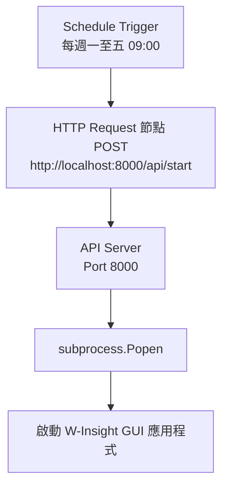


### 16.3 規格參數持久化與防禦設計
* **連線重試防禦**：`api_server.py` 在初始化 Socket 時已設定 `allow_reuse_address = True`。若 API 伺服器無預警重啟，可立即重新綁定 Port 8000，無需等待作業系統回收 Port，提供金融級的高可用度與防禦能力。
* **異步 GUI 拉起**：當觸發 `/api/start` 時，透過 `subprocess.CREATE_NEW_CONSOLE` 將 GUI 運作隔離在新的子行程中。如此一來，GUI 應用程式的運作與 API 服務完全解耦，GUI 視窗被關閉或操作卡頓都不會影響 API 伺服器的監聽狀態。

