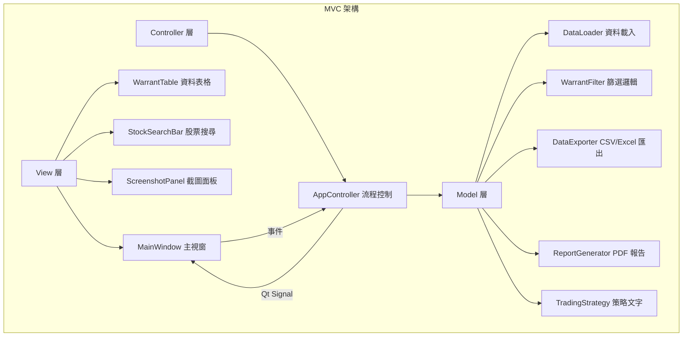
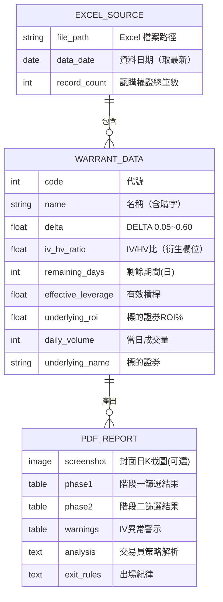
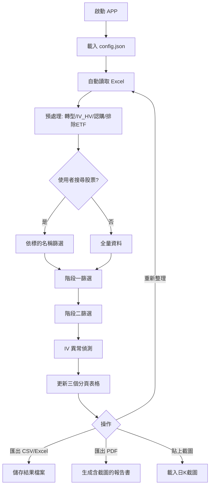
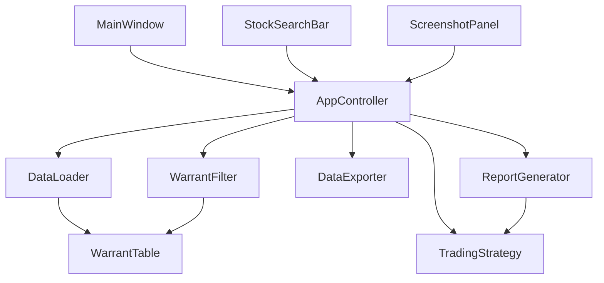
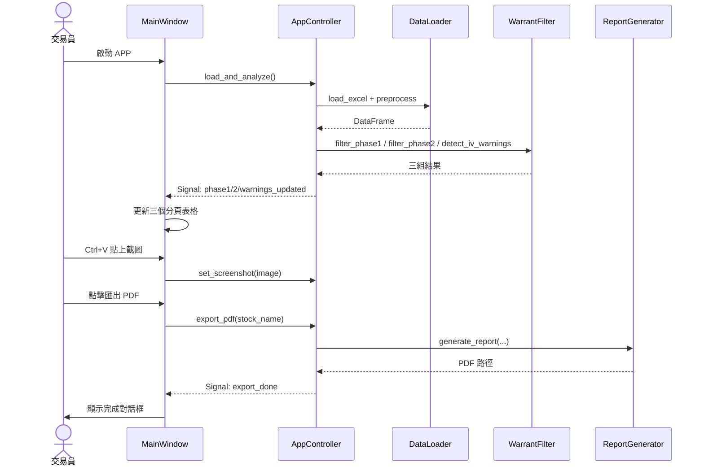
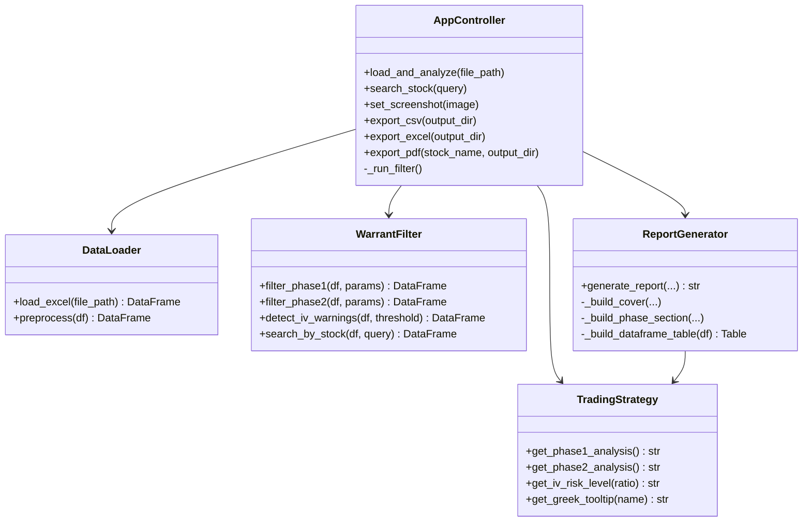
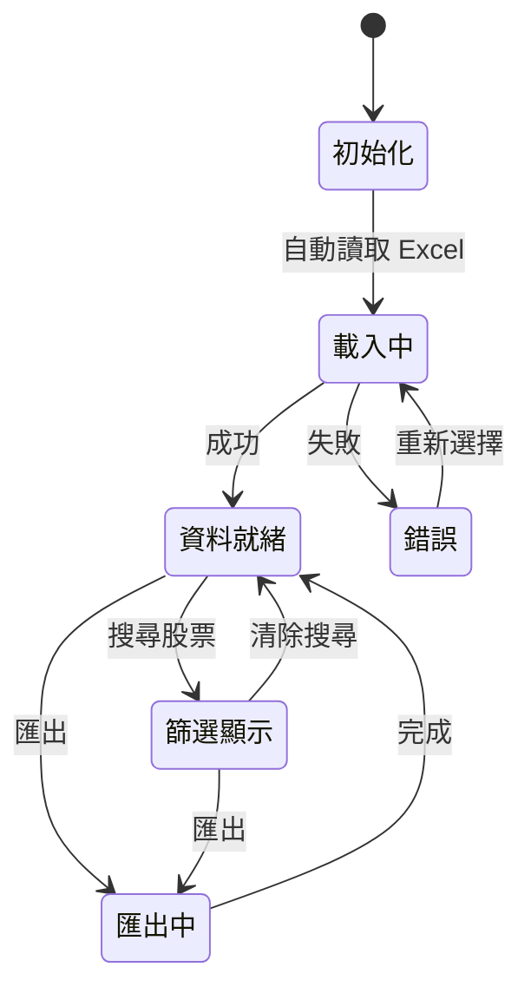
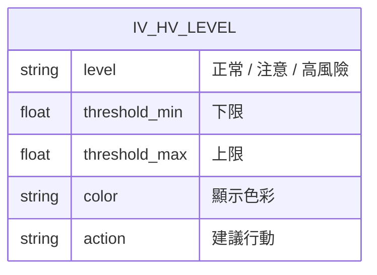
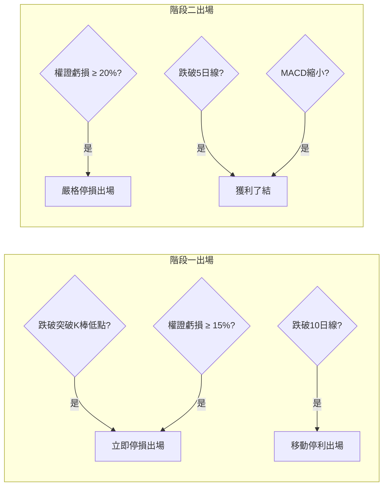

# W-Insight (權證洞察) — 規格文件

## 專案概述

本系統將「頂尖權證交易員 skill」的選股策略框架實作為 PyQt6 桌面 GUI 應用程式，  
資料來源為 TEJ/平台匯出的 Excel 檔案（DataExport.xlsx），無需爬蟲。

---

## 1. 架構與選型

| 層次 | 技術 | 說明 |
|------|------|------|
| GUI | PyQt6 | 桌面應用框架 |
| 資料處理 | Pandas | Excel 讀取與篩選 |
| Excel 讀寫 | openpyxl | 匯出多分頁 Excel |
| PDF 生成 | reportlab | 報告書生成，含中文字型 |
| 圖片處理 | Pillow | 截圖格式轉換 |
| 測試 | pytest | 單元測試 |
| 架構模式 | MVC | Model/View/Controller 分離 |

---

## 2. 資料模型

---

## 3. 關鍵流程

---

## 4. 兩階段策略篩選條件

### 階段一：突破起漲（安全建倉）

| 篩選條件 | 參數 | 說明 |
|----------|------|------|
| Delta | 0.40 ~ 0.60 | 價平附近，連動性佳 |
| 剩餘天數 | > 90 天 | 降低 Theta 時間損耗 |
| IV/HV | 0.70 ~ 1.30 | 避免造市商惡意調高 IV |
| 當日成交量 | ≥ 20 張 | 基本流動性門檻 |
| 標的 ROI% | > 1.5% | 確認現股動能 |

### 階段二：主升段飆漲（極致動能加碼）

| 篩選條件 | 參數 | 說明 |
|----------|------|------|
| Delta | 0.05 ~ 0.30 | 微價外，利用 Gamma 加速 |
| 剩餘天數 | 60 ~ 120 天 | 承受 Theta 換取高槓桿 |
| 有效槓桿 | ≥ 5 倍 | 實質槓桿門檻 |
| IV/HV | ≤ 1.30 | 排除劣質造市商 |
| 當日成交量 | ≥ 10 張 | 基本流動性 |
| 標的 ROI% | > 2.0% | 確認主升段動能 |

---

## 5. 模組關係圖

---

## 6. 序列圖（主要流程）

---

## 7. 類別圖（核心類別）

---

## 8. 狀態圖

---

## 9. IV/HV 風險等級（ER 圖）

| 等級 | IV/HV 範圍 | 顏色 | 建議 |
|------|-----------|------|------|
| 正常 | 0.70 ~ 1.30 | 🟢 深藍 | 可安心交易 |
| 注意 | 1.30 ~ 1.50 | 🟡 橘色 | 注意觀察 |
| 高風險 | > 1.50 | 🔴 紅色 | 建議迴避 |

---

## 10. 出場紀律流程圖

